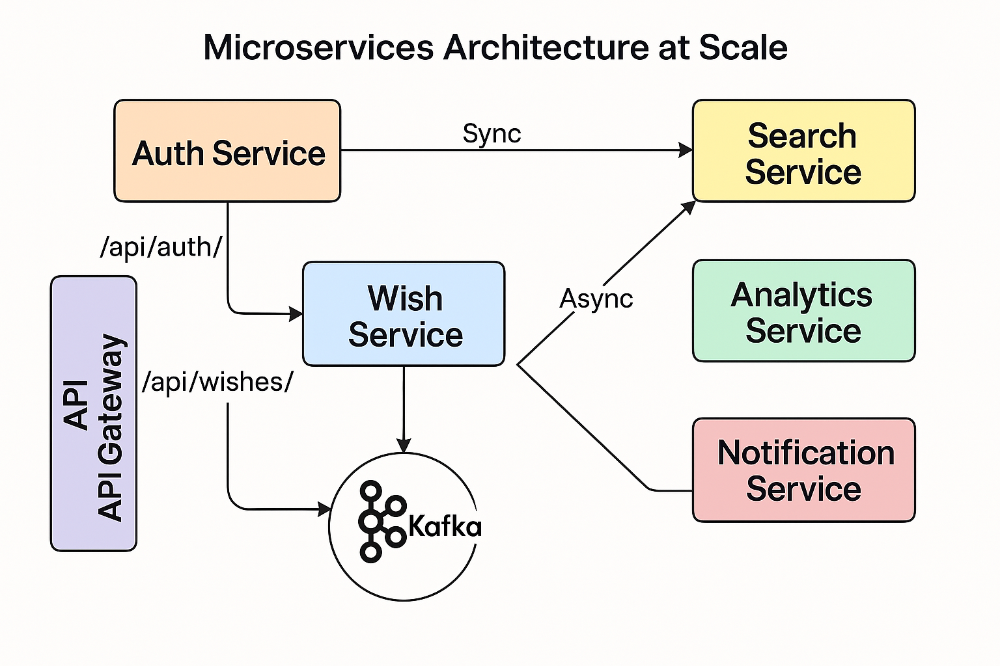

# 📦 Wishlist Service

A Java Spring Boot application with PostgreSQL, Redis, and JWT-based authentication.

## 🚀 Quick Start

1. Create a `.env` file based on `.env.example`
2. Build the JAR:

```bash
  mvn clean package
```

3. Launch everything with Docker Compose:

```bash
  make up-app
```

The application will be available at: [http://localhost:8080](http://localhost:8080)

---

## 🐞 Remote Debugging

1. Make sure port 5005 is exposed in `docker-compose.debug.yml`

2. Ensure your `.env` contains:
```env
JAVA_TOOL_OPTIONS=-agentlib:jdwp=transport=dt_socket,server=y,suspend=n,address=*:5005
```

3. In IntelliJ IDEA:
    - **Run → Edit Configurations → + → Remote JVM Debug**
    - Set `Host: localhost`, `Port: 5005`
    - Name the configuration and click OK

4. Click **Debug** — and you're in! 🐛

---

## ⚙️ Useful Commands

```bash
  make up         # Start databases (PostgreSQL + Redis)
```
```bash
  make up-app     # Start app + databases
```
```bash
  make up-debug   # Start app + databases in remote debug mode
```
```bash
  make down       # Stop and remove databases and volumes
```
```bash
  make down-app   # Stop and remove everything
```
```bash
  make down-debug # Stop and remove everything running in remote debug mode
```
```bash
  make restart    # Rebuild and restart everything
```
```bash
  make logs       # View logs
```

---

## 🧪 Testing

```bash
  mvn test
```

---

## 📘 API Documentation

You can access the Swagger UI when the app is running:

[http://localhost:8080/api/swagger-ui/index.html](http://localhost:8080/api/swagger-ui/index.html)

---

## 🔄 CI/CD

You can integrate this project with GitHub Actions or GitLab CI for automatic testing and Docker-based deployment. Here's a basic flow:

- **Build stage**: Run unit and integration tests
- **Package stage**: Build the JAR using Maven
- **Docker stage**: Build and push Docker image
- **Deploy stage**: Deploy using docker-compose or Kubernetes

Feel free to expand based on your deployment workflow.

---

## 🗺️ Plans

As the application grows, we aim to evolve it into a microservices-based architecture. Here's a high-level plan:

- Split the monolith into dedicated microservices:
   - `AuthService` (authentication, JWT issuance)
   - `WishService` (CRUD operations, Redis caching)
   - `SearchService` (full-text search using Elasticsearch)
   - `AnalyticsService` (optional, for usage tracking and trends)
   - `NotificationService` (optional, for reminders/alerts)
- Use **Apache Kafka** for inter-service event streaming
- Introduce **Spring Cloud Gateway** for centralized routing and JWT validation
- Scale each service independently
- Store data in optimal formats for each service (PostgreSQL, Redis, Elasticsearch)

### Architecture Diagram



---

## 📝 License
MIT
